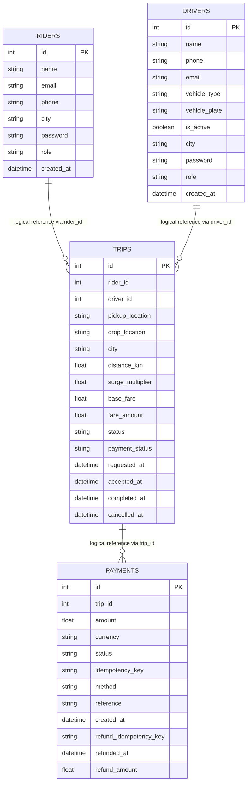

# ER Diagram (Mermaid)

The following ER diagram represents the four core service databases.  
Relationships are **logical cross-service references** (not DB foreign key constraints).

```mermaid
erDiagram
    RIDERS {
        int id PK
        string name
        string email
        string phone
        string city
        string password
        string role
        datetime created_at
    }

    DRIVERS {
        int id PK
        string name
        string phone
        string email
        string vehicle_type
        string vehicle_plate
        boolean is_active
        string city
        string password
        string role
        datetime created_at
    }

    TRIPS {
        int id PK
        int rider_id
        int driver_id
        string pickup_location
        string drop_location
        string city
        float distance_km
        float surge_multiplier
        float base_fare
        float fare_amount
        string status
        string payment_status
        datetime requested_at
        datetime accepted_at
        datetime completed_at
        datetime cancelled_at
    }

    PAYMENTS {
        int id PK
        int trip_id
        float amount
        string currency
        string status
        string idempotency_key
        string method
        string reference
        datetime created_at
        string refund_idempotency_key
        datetime refunded_at
        float refund_amount
    }

    RIDERS ||--o{ TRIPS : "logical reference via rider_id"
    DRIVERS ||--o{ TRIPS : "logical reference via driver_id"
    TRIPS ||--o{ PAYMENTS : "logical reference via trip_id"
```
